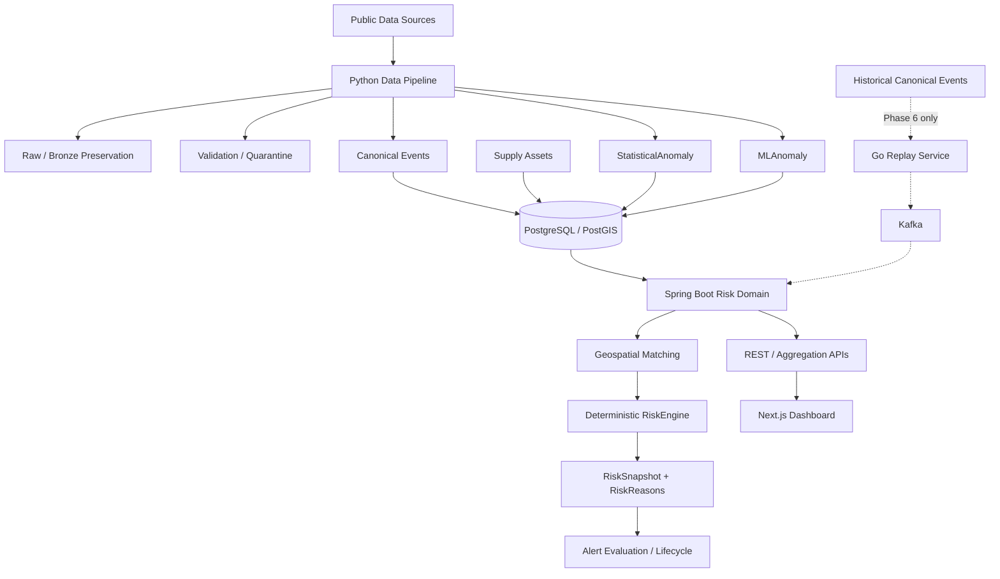

# ChainSignal — Data Flow Draft

```mermaid
flowchart TD
    S[Public Data Sources] --> P[Python Data Pipeline]
    P --> B[Raw / Bronze Preservation]
    P --> Q[Validation / Quarantine]
    P --> C[Canonical Events]
    C --> DB[(PostgreSQL / PostGIS)]
    A[Supply Assets] --> DB
    DB --> J[Spring Boot Risk Domain]
    J --> G[Geospatial Matching]
    G --> R[Deterministic RiskEngine]
    R --> RS[RiskSnapshot + RiskReasons]
    RS --> AL[Alert Evaluation / Lifecycle]
    J --> API[REST / Aggregation APIs]
    API --> UI[Next.js Dashboard]
    P --> SA[StatisticalAnomaly]
    P --> MA[MLAnomaly]
    SA --> DB
    MA --> DB

    HE[Historical Canonical Events] -. Phase 6 only .-> GO[Go Replay Service]
    GO -.-> K[Kafka]
    K -.-> J
```
