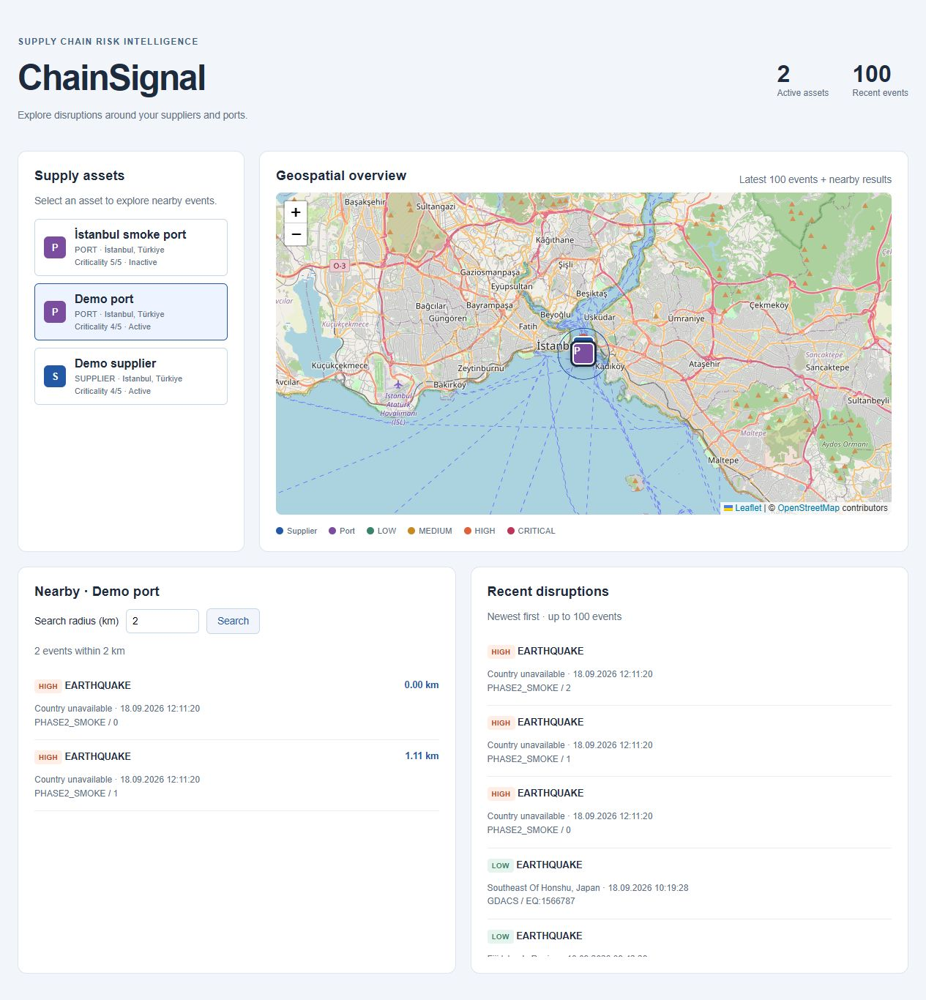
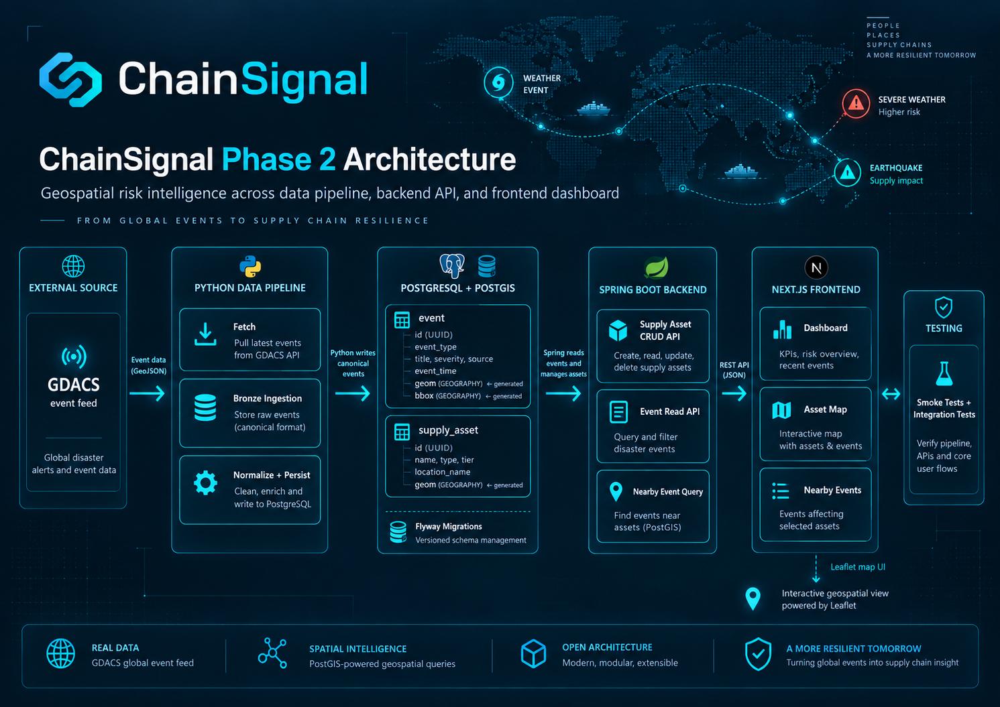
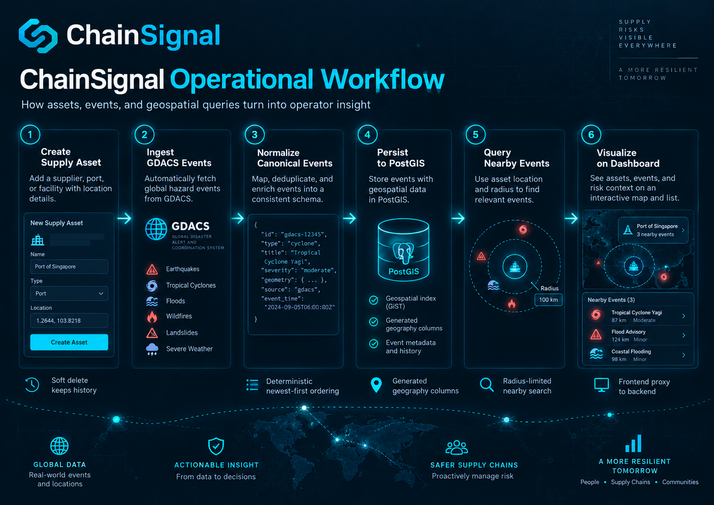
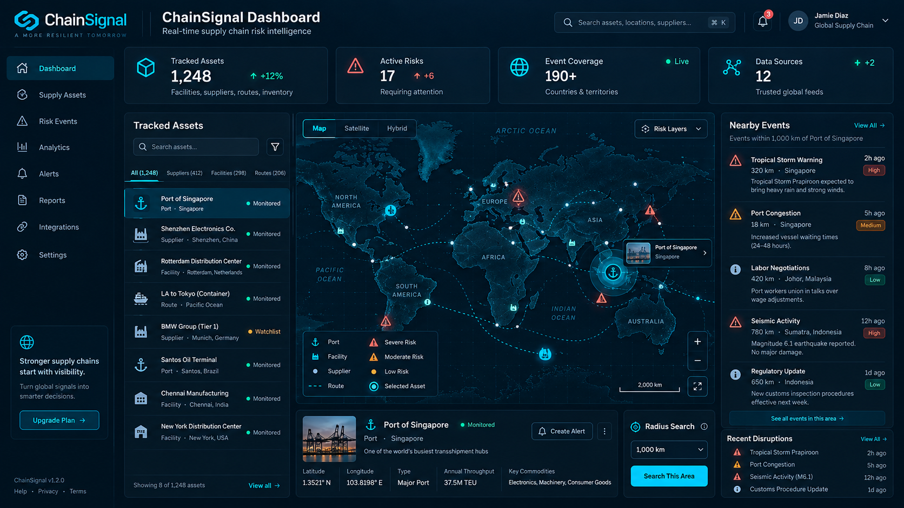

# Phase 2 visual overview

Phase 2 connects public data to Python ingestion and canonical Event persistence,
PostgreSQL/PostGIS, Spring Boot APIs and a Next.js/Leaflet dashboard. Python owns
Event writes; Spring owns SupplyAsset lifecycle and reads events; Flyway alone
owns operational migrations. See the [API contract](phase-2-api.md),
[canonical Event contract](canonical-event-contract.md) and
[acceptance checklist](phase-2-checklist.md) for implemented behavior.

## Current Phase 2 dashboard

Actual browser capture of the disposable Compose dashboard during acceptance.
The assets and nearby earthquake events are explicitly named smoke/demo fixtures;
recent GDACS events come from live ingestion. Counts describe this disposable
dataset, not production coverage. No generated artwork appears in this capture.

## Conceptual system visualization

Conceptual Phase 2 system visualization. Source code, Flyway migrations and the
API contract remain authoritative. The generated schema labels are illustrative:
real identifiers are BIGINT identities; the generated geography column is
`location`, with no generated `bbox`. Canonical fields include `occurred_at`,
coordinates and JSONB metadata, rather than the artwork's title/event_time fields.
Phase 2 has no risk scoring or risk KPI API.

## Conceptual operational workflow

Conceptual operational workflow visualization. Phase 2 tracks SUPPLIER and PORT
assets, created through the API. The current dashboard has no asset creation form.
The canonical taxonomy is EARTHQUAKE, FLOOD, CONFLICT, PROTEST and STRIKE; the
GDACS adapter currently normalizes earthquakes and floods. Cyclones, wildfires,
landslides, facilities and the illustrated JSON fields are not implemented
contracts. Bronze preserves raw provider data before canonical normalization.

## Dashboard concept

Concept visualization — the current Phase 2 dashboard implements the asset/event
map and nearby-event workflow; this image illustrates a future product direction.
Its user identity, metrics, alerts, analytics, routes, facilities and commercial
controls are fictional and do not describe delivered Phase 2 capabilities.

## Branding and social preview

The [README hero](../frontend/public/brand/chainsignal-hero.png) and
[Open Graph artwork](../frontend/public/og/chainsignal-phase2-og.png) are conceptual
branding. Metrics and hazard labels inside these generated images are illustrative.
Next metadata describes the implemented stack and uses the static OG asset.
